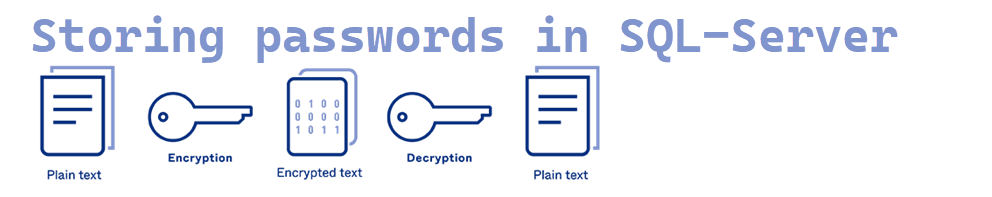



# Introduction

Developers just starting working with Windows Forms, WPF or Console applications tend to use plain text to store passwords in a database which is not wise as anyone that can open the database can see these passwords stored in plain text.

# Example 1
An easy method to store passwords is [PWDENCRYPT](https://learn.microsoft.com/en-us/sql/t-sql/functions/pwdencrypt-transact-sql?view=sql-server-ver16) which might not be supported in future releases of SQL-Server, the second example uses [HASHBYTES](https://learn.microsoft.com/en-us/sql/t-sql/functions/hashbytes-transact-sql?view=sql-server-ver16) which offers more options.

```sql
INSERT INTO dbo.Users (Username,Password) VALUES ('payneoregon',PWDENCRYPT('!FirstOnMonday'))
```

To return the password we use [PWDCOMPARE](https://learn.microsoft.com/en-us/sql/t-sql/functions/pwdcompare-transact-sql?view=sql-server-ver16)


```csharp
public static bool ValidateUser(string username, SecureString password)
{
    using var cn = new SqlConnection(ConfigurationHelper.ConnectionString());
    using var cmd = new SqlCommand() { Connection = cn };
    cmd.CommandText = "SELECT Id from dbo.Users WHERE Username = @UserName AND PWDCOMPARE(@Password,[Password]) = 1";
    cmd.Parameters.Add("@UserName", SqlDbType.NChar).Value = username;
    cmd.Parameters.Add("@Password", SqlDbType.NChar).Value = password.ToUnSecureString();

    cn.Open();
    return cmd.ExecuteScalar() != null;
}
```

# Example 2

This method provides more options using [HASHBYTES](https://learn.microsoft.com/en-us/sql/t-sql/functions/hashbytes-transact-sql?view=sql-server-ver16). In the following example only the password is protected, if you like, the next step would be to concatenate the user name and password together.

```sql
INSERT INTO Users1 (UserName, [Password]) VALUES ('payneoregon', HASHBYTES('SHA2_512', '!FirstOnMonday'));
```

To validate the password use the following SQL-Server function.

```sql
CREATE OR ALTER FUNCTION Password_Check ( @v1 VARCHAR(500) )
RETURNS VARCHAR(7)
AS
BEGIN
    DECLARE @result VARCHAR(7);

    SELECT @result = (CASE
                          WHEN [Password] = HASHBYTES('SHA2_512', @v1) THEN
                              'Valid'
                          ELSE
                              'Invalid'
                      END
                     )
    FROM Users1
    WHERE [Password] = HASHBYTES('SHA2_512', @v1);

    RETURN @result;

END;
```

Code

```csharp
public static bool ValidateUser1(string username, SecureString password)
{
    using var cn = new SqlConnection(ConfigurationHelper.ConnectionString());
    using var cmd = new SqlCommand() { Connection = cn };

    cmd.CommandText = "SELECT Id from dbo.Users WHERE Username = @UserName";
    cmd.Parameters.Add("@UserName", SqlDbType.NChar).Value = username;
    cn.Open();

    var result = cmd.ExecuteScalar();

    if (cmd.ExecuteScalar() == null)
    {
        return false;
    }

    cmd.CommandText = "SELECT [dbo].[Password_Check](@Password);";
    cmd.Parameters.Add("@Password", SqlDbType.NChar).Value = password.ToUnSecureString();


    return Convert.ToString(cmd.ExecuteScalar()) == "Valid";

}
```

## Next steps

- Placing desired option into a class project.
- If option 2, create the function presented modified for your databases


# Credentials

Use the following to see the code work then provide invalid information.

- **UserName** payneoregon
- **Password** !FirstOnMonday


# Requires

- Microsoft Visual Studio 2022 version 17.4 or higher
- LocalDb installed which should be done when Visual Studio is installed.


# Ending notes

I kept the code sample simple so they can be used `as is` or modified to suit indivdual requirements.