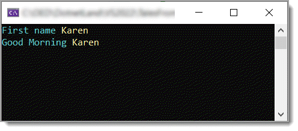
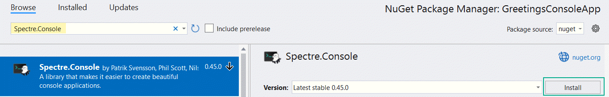
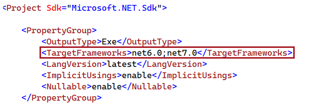

# About

Most hello world projects are done in the console that have static text and are black and white. Let’s create a console hello world with color which will prompt for a name and greet with time of day.

# How to create this project

Finished product



## Create a new console project targeting .NET Core 6.

With Visual Studio open to a Visual Studio solution and `Solution Explorer` open, right click on the `top node` and `select add new project`. `Select console`. Give it a name of GreetingsConsoleApp, click the Next button, check Do not use top-level statements, click the create button. Once Program.cs is displayed, remove the Console.WriteLine line.

Right click on `Dependences` in Solution Explorer, select `Manage NuGet packages`, select the `Browse tab`.

In the Search input enter Spectre.Console, click the Install button, accept any prompts as Ok and Accept.





Back in Program.cs, Main method add the following code and add the using statement for Spectre.Console.

```csharp
using Spectre.Console;
 
class Program
{
    public static void Main(string[] args)
    {
        string firstName = AnsiConsole.Prompt(
            new TextPrompt<string>("[cyan]First name[/]").PromptStyle("yellow")
                .AllowEmpty());
 
        if (!string.IsNullOrWhiteSpace(firstName))
        {
            
        }
    }
}

```

[AnsiConsole](https://spectreconsole.net/markup) code presents a prompt to enter the user’s first name followed by asserting that there is a name, not an empty string.

See also: [AnsiConsole colors](https://spectreconsole.net/appendix/colors)

Next we will write code to greet the person using the following method which is placed under the `Main method`. 
This method uses a [switch expression](https://learn.microsoft.com/en-us/dotnet/csharp/language-reference/operators/switch-expression)  to determine time of day, if the hour is less than 12 (noon) it’s morning, 
if the hour is greater than 12 and less than 16, it the afternoon, if less than 20 it’s evening and the default, night time.

```csharp
public static string TimeOfDay() =>
    DateTime.Now.Hour switch
    {
        <= 12 => "Good Morning",
        <= 16 => "Good Afternoon",
        <= 20 => "Good Evening",
        _ => "Good Night"
    };
```

Back in `Main method` let’s present the user with time of day and their name.

```csharp
if (!string.IsNullOrWhiteSpace(firstName))
{
    AnsiConsole.MarkupLine($"[cyan]{TimeOfDay()}[/] [yellow]{firstName}[/]");
    Console.ReadLine();
}
```

AnsiConsole.MarkupLine uses defined colors to display text. In this case `[cyan]` starts a block to color and `[/]` closes the block. All text wrapped in `{}` Bob Hope brackets is known as string interpolation which for this to work the string must have a dollar sign prepended to the string.

**Important note** all color brackets must have a closing bracket e.g. `[cyan]`Hey`[/]` if the closing bracket is missing a unbalanced exception is raised, similar, misspell a color, an exception is thrown.

What happens if no input is entered for first name? The program closes. What if we want the user to not leave the input empty? Remove `.AllowEmpty()` but now they need to either enter a name or close the application. There are better ways to handle this but for now lets keep it simple.

Now the code will appear as follows (**note** the .AllowEmpty() is commented out).

```csharp
using Spectre.Console;
 
namespace GreetingsConsoleApp;
 
class Program
{
    public static void Main(string[] args)
    {
        string firstName = AnsiConsole.Prompt(
            new TextPrompt<string>("[cyan]First name[/]").PromptStyle("yellow")
            //.AllowEmpty()
        );
 
        if (!string.IsNullOrWhiteSpace(firstName))
        {
            AnsiConsole.MarkupLine($"[cyan]{TimeOfDay()}[/] [yellow]{firstName}[/]");
            Console.ReadLine();
        }
    }
 
    public static string TimeOfDay() =>
        DateTime.Now.Hour switch
        {
            <= 12 => "Good Morning",
            <= 16 => "Good Afternoon",
            <= 20 => "Good Evening",
            _ => "Good Night"
        };
}
```

Let’s move the `TimeOfDay` to a `class` next so if you want to use it in another project, copy and paste, change the namespace and use it.

Right click on the project in Solution Explorer, add a `new folder named Classes`. Right click on the new folder, add a `new class` named `Helpers` and copy the code in below.

```csharp
namespace GreetingsConsoleApp.Classes;
 
internal class Helpers
{
    public static string TimeOfDay() =>
        DateTime.Now.Hour switch
        {
            <= 12 => "Good Morning",
            <= 16 => "Good Afternoon",
            <= 20 => "Good Evening",
            _ => "Good Night"
        };
}
```

Back in Program.cs, add the following using statement

```csharp
using GreetingsConsoleApp.Classes;
```

Change

```csharp
AnsiConsole.MarkupLine($"[cyan]{TimeOfDay()}[/] [yellow]{firstName}[/]");
```

To

```csharp
AnsiConsole.MarkupLine($"[cyan]{Helpers.TimeOfDay()}[/] [yellow]{firstName}[/]");
```

Remove TimeOfDay from the Program class and done, run the program.

# Target multiple Frameworks

Microsoft docs: [Create a project that supports multiple .NET Framework versions](https://learn.microsoft.com/en-us/nuget/create-packages/multiple-target-frameworks-project-file#create-a-project-that-supports-multiple-net-framework-versions)




