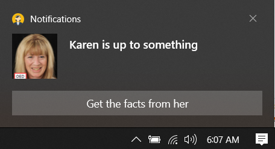

# About

A very simple example for toast notifications where it is configured to clear the event to capture user actions when the application is closed, to change this behavior comment out the code in form closing event.

Note, the following event `OnActived` runs in a different thread than the calling code so we must use `Invoke` to prevent cross-threading.

```csharp
private void OnShown(object sender, EventArgs e)
{
           
    ToastNotificationManagerCompat.OnActivated += toastArgs =>
    {
        ToastArguments args = ToastArguments.Parse(toastArgs.Argument);

        if (args.Contains("conversationId"))
        {
            if (args["conversationId"] == "9814")
            {
                        
                Invoke(delegate
                {
                    Dialogs.Information(ExecuteButton,"Notification triggered", "Woohoo");
                });
            }
        }

    };
}
```

Notification presented.



Dialog from `OnShown` above


# Required

In the project file

